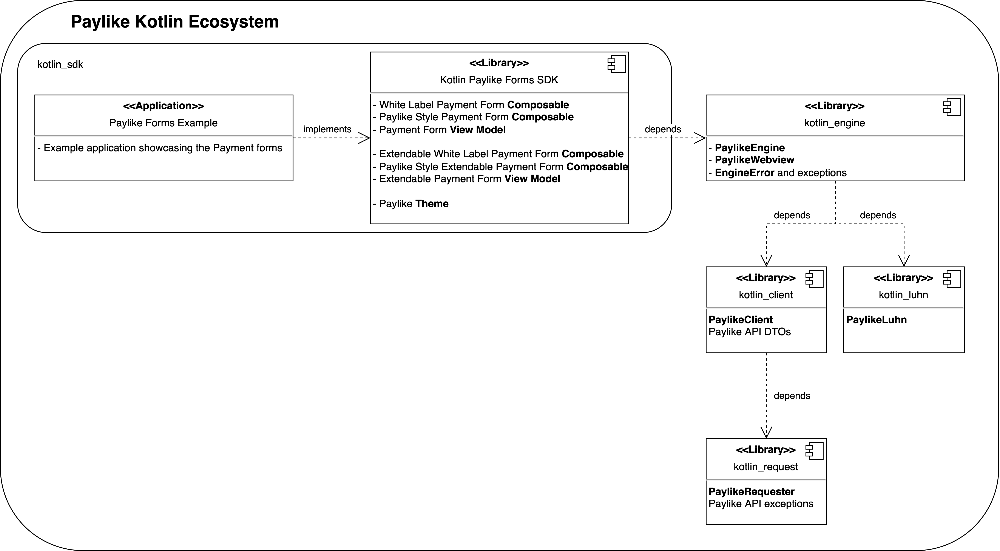

# Paylike's Android SDK
<a href="https://jitpack.io/#paylike/kotlin_sdk" target="_blank">
    
</a>
<a href="/../../actions/workflows/AssembleOnMain.yml" target="_blank">
    
</a>

This library includes the high level components providing complete payment forms to use the Paylike ecosystem.  
If you are looking for our core elements required to implement payment flow towards the API, [check here](https://github.com/paylike/kotlin_engine).

## Table of Contents
---
- [Paylike's Android SDK](#paylikes-android-sdk)
  - [Table of Contents](#table-of-contents)
  - [General Info](#general-info)
    - [Purpose of this library](#purpose-of-this-library)
    - [Used Android API level and Technologies](#used-android-api-level-and-technologies)
    - [Paylike API Reference](#paylike-api-reference)
    - [Paylike Kotlin Ecosystem](#paylike-kotlin-ecosystem)
  - [Usage](#usage)
  - [TL;DR](#tldr)
  - [Forms](#forms)
    - [Simple Forms](#simple-forms)
      - [Simple White Label Form](#simple-white-label-form)
      - [Simple Paylike Style Form](#simple-paylike-style-form)
    - [Extendable Forms](#extendable-forms)
      - [Extendable White Label Form](#extendable-white-label-form)
      - [Extendable Paylike Style Form](#extendable-paylike-style-form)
  - [Custom Implementation](#custom-implementation)
    - [Custom Theming](#custom-theming)
    - [Custom Engine State Change Event Callbacks](#custom-engine-state-change-event-callbacks)
  - [Details](#details)
    - [Localisation](#localisation)
    - [Error Handling](#error-handling)
  - [Example Application](#example-application)

## General Info
---
### Purpose of this library
This library was created to provide the simplest way of integrating Paylike into your Android application.  
It provides views and viewModels to create a payment form and an easy way to handle the payment result.

### Used Android API level and Technologies
The minimal supported Android SDK is **26** (Oreo). It supports the 88.2% of the Android devices. (Last updated: 04.08.2022)  
For the UI related design and implementation the chosen technology is **Jetpack Compose**.

### Paylike API Reference
For the library you can find the API reference [here](https://paylike.io#todo-link).  
To get more familiar with our server API you can find here the [official documentation](https://github.com/paylike/api-reference).

### Paylike Kotlin Ecosystem



## Usage
---

To use the ecosystem you have to ask for internet usage permission.

AndroidManifest.xml
```xml
    <uses-permission android:name="android.permission.INTERNET" />
```

The library is going to be hosted by [Jitpack](https://jitpack.io/) and [MavenCentral](https://mvnrepository.com/repos/central),
so do not forget to add any of them to your repositories.

settings.gradle
```groovy
// ...

dependencyResolutionManagement {
    repositoriesMode.set(RepositoriesMode.FAIL_ON_PROJECT_REPOS)
    repositories {
        // ...
        maven {
            url 'https://jitpack.io'
        }

        // or

        mavenCentral()
    }
}

// ...

```

build.gradle
```groovy
plugins {
    id 'com.android.application'
    id 'org.jetbrains.kotlin.android'
    // ...
}

def paylike_android_sdk_version = "X.Y.Z"

android {
    // ...

    // Take care of the definition and import of your **own** merchant ID (API key (secret))
    // See:
    // * https://paylike.io/platforms/integration
    // * https://github.com/paylike/api-docs#getting-an-api-key

    // def PaylikeMerchantApiKey = "loadingApiKeyFromEnv"
    // ...

    packagingOptions {
        // ...
        exclude 'META-INF/DEPENDENCIES'
    }
}

dependencies {
    // ... your dependencies

    implementation "com.github.paylike:kotlin_sdk:$paylike_android_sdk_version"
}

```

## TL;DR
---
Don't forget to create your **OWN** API key (merchant ID) for the Paylike ecosystem. See: https://paylike.io/platforms/integration & https://github.com/paylike/api-docs#getting-an-api-key

```kotlin
import android.os.Bundle
import android.util.Log
import androidx.activity.ComponentActivity
import androidx.activity.compose.setContent
import androidx.compose.ui.Modifier
import com.example.testpaylikesdk.ui.theme.TestPaylikeSdkTheme
import com.github.paylike.kotlin_client.domain.dto.payment.request.PaymentData
import com.github.paylike.kotlin_client.domain.dto.payment.request.money.PaymentAmount
import com.github.paylike.kotlin_client.domain.dto.payment.request.test.PaymentTestDto
import com.github.paylike.kotlin_engine.model.service.ApiMode
import com.github.paylike.kotlin_engine.viewmodel.PaylikeEngine
import com.github.paylike.kotlin_sdk.whitelabel.simple.view.WhiteLabelComposable
import com.github.paylike.kotlin_sdk.whitelabel.simple.viewmodel.WhiteLabelViewModel

class MainActivity : ComponentActivity() {
    override fun onCreate(savedInstanceState: Bundle?) {
        super.onCreate(savedInstanceState)

        val paymentData = PaymentData(
            test = PaymentTestDto(), // For test purposes
            amount = PaymentAmount(
                "EUR",
                1L,
                0,
            ),
        )

        val exampleViewModel = WhiteLabelViewModel(
            engine = PaylikeEngine(
                merchantId = BuildConfig.PaylikeMerchantApiKey, // Your OWN merchant key, highly recommended to store it in obfuscated environmental variable and not hardcode it to codebase. Can be obtained from Paylike.
                apiMode = ApiMode.TEST, // For test purposes
            ),
        )

        exampleViewModel.addDescriptionPaymentDataToEngine(
            paymentTestData = paymentData.test,
            paymentAmount = paymentData.amount,
        )

        setContent {
            WhiteLabelComposable(
                modifier = Modifier,
                viewModel = exampleViewModel,
            )
        }
    }
}

```

## Forms
---
### Simple Forms
#### Simple White Label Form
This form provides the simplest implementation of a payment flow.  
**Features**:
* Card number input field (indicating the recognized card issuer; supported cards are Maestro, MasterCard and Visa),
* expiry date input field,
* card verification code input field,
* pay button,
* webView to help TDS and
* can receive custom theme definition.

Every field has a realtime sanitation and check if its acceptable. Pushing the pay button has a check if every field meets the requirements, if not refuses to trigger the payment flow. If every field exaushted the expected conditions then the payment flow starts, the fields become disabled and the button disappears. The webView appears when necessary, accepts user input to solve TDS, then disappears. This form does not show any sign of feedback about the flow. The navigation to and from the form is up to the developer. In case of any error at any time, the form jumps to the error state, but like success state, does not show any feedback.  
Theme has to be defined like built-in MaterialTheme.

The white label view model has UI states what are used only by the Paylike style form.

SampleActivity.kt
```kotlin
import com.github.paylike.kotlin_client.domain.dto.payment.request.PaymentData
import com.github.paylike.kotlin_client.domain.dto.payment.request.money.PaymentAmount
import com.github.paylike.kotlin_engine.model.service.ApiMode
import com.github.paylike.kotlin_engine.viewmodel.PaylikeEngine
import com.github.paylike.kotlin_sdk.whitelabel.simple.view.WhiteLabelComposable
import com.github.paylike.kotlin_sdk.whitelabel.simple.viewmodel.WhiteLabelViewModel

class SampleActivity : ComponentActivity() {
    @OptIn(ExperimentalMaterialApi::class)
    override fun onCreate(savedInstanceState: Bundle?) {
        super.onCreate(savedInstanceState)
        // Example data to pay 1 Euro
        val paymentData = PaymentData(
            amount = PaymentAmount(
                "EUR",
                1L,
                0,
            ),
        )

        // Instantiation of VM, and including Engine
        val exampleViewModel = WhiteLabelViewModel(
            engine = PaylikeEngine(
                merchantId = BuildConfig.PaylikeMerchantApiKey, // Your OWN merchant key, highly recommended to store it in obfuscated environmental variable and not hardcode it to codebase. Can be obtained from Paylike.
                apiMode = ApiMode.LIVE, // Test mode: ApiMode.TEST
            ),
            //  optionally webView, or use the default Paylike webView, defined in kotlin_engine.
            //  optionally onPayButton callback, or use the default implementation, which starts the async process of sensitive card data tokenizing.
        )

        // Add payment amount, and additionally any other defined data to VM. See: https://github.com/paylike/kotlin_engine and Paylike API documentation
        exampleViewModel.addDescriptionPaymentDataToEngine(
            //  paymentTestData = paymentTestData, // Only in test mode
            paymentAmount = paymentData.amount,
            //  paymentPlanDataList = paymentPlanDto,
            //  paymentUnplannedData = paymentUnplannedDto,
        )
        // optionally
        //  exampleViewModel.addAdditionalPaymentDataToEngine(
        //      textData,
        //      customData,
        //  )

        setContent {
            // Compose view
            WhiteLabelComposable(
                modifier = Modifier,
                viewModel = exampleViewModel,
                // theme = { content -> run { MaterialTheme { content.invoke() } } }, // optionally overridden theming
            )
        }
    }
}

```
#### Simple Paylike Style Form
This form provides the simplest implementation of a payment flow and add supplementary UX features to provide Paylike style UI for the user ensuring trust.

**Added features:**
* Applied PaylikeTheme over the view,
* secure payment label under the form,
* in-progress spinner indicating ongoing process,
* successful payment animation and
* error message feedback if any.

This form has the works the same way as the white label one.

SampleActivity.kt
```kotlin
import com.github.paylike.kotlin_client.domain.dto.payment.request.PaymentData
import com.github.paylike.kotlin_client.domain.dto.payment.request.money.PaymentAmount
import com.github.paylike.kotlin_engine.model.service.ApiMode
import com.github.paylike.kotlin_engine.viewmodel.PaylikeEngine
import com.github.paylike.kotlin_sdk.paylikeStyle.view.PaylikeStyleSimpleWhiteLabelComposable
import com.github.paylike.kotlin_sdk.whitelabel.simple.viewmodel.WhiteLabelViewModel

class SampleActivity : ComponentActivity() {
    @OptIn(ExperimentalMaterialApi::class)
    override fun onCreate(savedInstanceState: Bundle?) {
        super.onCreate(savedInstanceState)

        // Example data to pay 1 Euro
        val paymentData = PaymentData(
            amount = PaymentAmount(
                "EUR",
                1L,
                0,
            ),
        )

        // Same as simple white label form
        // Instantiation of VM, and including Engine
        val exampleViewModel = WhiteLabelViewModel(
            engine = PaylikeEngine(
                merchantId = BuildConfig.PaylikeMerchantApiKey, // Your OWN merchant key
                apiMode = ApiMode.LIVE, // Test mode: ApiMode.TEST
            ),
        )

        // Same as simple white label form
        // Add payment amount
        exampleViewModel.addDescriptionPaymentDataToEngine(
            paymentAmount = paymentData.amount,
        )

        setContent {
            // Compose view
            PaylikeStyleSimpleWhiteLabelComposable(
                modifier = Modifier,
                viewModel = exampleViewModel,
            )
        }
    }
}

```

### Extendable Forms
#### Extendable White Label Form
This form provides extendable implementation of a payment flow with the capability to add arbitrary field(s).
This form has the same capabilities and UX as the [Simple White Label Form](#simple-white-label-form).

**Added Features**:
* Can easily add extra input field(s) to the form,
* ExtenderFieldModel takes care of the field states,
* ExtendableWhiteLabelViewModel receives
    * list of ExtenderFieldModels and
    * onExtendedPayButton callback to handle the added extra field(s), and finally
* one predefined additional field: "NoteField".

SampleActivity.kt
```kotlin
import com.github.paylike.kotlin_client.domain.dto.payment.request.PaymentData
import com.github.paylike.kotlin_client.domain.dto.payment.request.money.PaymentAmount
import com.github.paylike.kotlin_engine.model.service.ApiMode
import com.github.paylike.kotlin_engine.viewmodel.PaylikeEngine
import com.github.paylike.kotlin_sdk.NoteField
import com.github.paylike.kotlin_sdk.whitelabel.extendable.view.ExtendableWhiteLabelComposable
import com.github.paylike.kotlin_sdk.whitelabel.extendable.viewmodel.ExtendableWhiteLabelViewModel
import com.github.paylike.kotlin_sdk.whitelabel.extendable.viewmodel.ExtenderFieldModel

class SampleActivity : ComponentActivity() {
    @OptIn(ExperimentalMaterialApi::class)
    override fun onCreate(savedInstanceState: Bundle?) {
        super.onCreate(savedInstanceState)

        // Example data to pay 1 Euro
        val paymentData = PaymentData(
            amount = PaymentAmount(
                "EUR",
                1L,
                0,
            ),
        )

        // Define the extender field viewModel state
        val noteExtenderField = ExtenderFieldModel(
            extenderFieldState = mutableStateOf(""), // stored input state
            //  onChangedPipeLineFunction = { newValue -> newValue }, // Optionally overridden input sanitation and check capability
            extenderFieldComposable = { modifier, value, textStyle, isEnabled, onValueChanged -> // stored field composable
                NoteField(
                    modifier = modifier,
                    value = value,
                    textStyle = textStyle,
                    isEnabled = isEnabled,
                    onValueChanged = onValueChanged,
                )
            }
        )

        // Instantiation of VM, and including Engine.
        // Additionally add extra field(s) and adjust the onExtenderPayButton
        // to load the added extra field(s) to the engine along the card data.
        val exampleViewModel = ExtendableWhiteLabelViewModel(
            engine = PaylikeEngine(
                merchantId = BuildConfig.PaylikeMerchantApiKey, // Your OWN merchant key
                apiMode = ApiMode.LIVE, // Test mode: ApiMode.TEST
            ),
            // Added extra field state to viewModel
            extenderFieldList = mutableListOf(
                noteExtenderField,
            ),
            // Overridden payButton callback, including the extra input field(s) process
            onExtendedPayButton = { engine,
                                    cardNumber,
                                    cvc,
                                    expiryMonth,
                                    expiryYear,
                                    extenderFields ->
                // Add card data as it was in the simple case,
                engine.addEssentialPaymentData(
                    cardNumber,
                    cvc,
                    expiryMonth,
                    expiryYear,
                )
                // then add the additional optional data to the field.
                engine.addAdditionalPaymentData(
                    textData = extenderFields!![0],
                    //  customData = MyJsonObject // this additional data can be arbitrarily formatted JSON object
                )
            },
        )

        // Same as simple white label form
        // Add payment amount
        exampleViewModel.addDescriptionPaymentDataToEngine(
            paymentAmount = paymentData.amount,
        )

        setContent {
            // Compose view
            ExtendableWhiteLabelComposable(
                modifier = Modifier,
                viewModel = exampleViewModel,
                // theme = { content -> run { MaterialTheme { content.invoke() } } }, // optionally overridden theming
            )
        }
    }
}

```
#### Extendable Paylike Style Form
This form provides extendable implementation of a payment flow with the capability to add arbitrary field(s) with the built-in Paylike UX.
This form is the "combination" of [Extendable White Label Form](#extendable-white-label-form) and [Simple Paylike Style Form](#simple-paylike-style-form), feature-wise.

SampleActivity.kt
```kotlin
import com.github.paylike.kotlin_client.domain.dto.payment.request.PaymentData
import com.github.paylike.kotlin_client.domain.dto.payment.request.money.PaymentAmount
import com.github.paylike.kotlin_engine.model.service.ApiMode
import com.github.paylike.kotlin_engine.viewmodel.PaylikeEngine
import com.github.paylike.kotlin_sdk.NoteField
import com.github.paylike.kotlin_sdk.paylikeStyle.view.PaylikeStyleExtendableWhiteLabelComposable
import com.github.paylike.kotlin_sdk.whitelabel.extendable.viewmodel.ExtendableWhiteLabelViewModel
import com.github.paylike.kotlin_sdk.whitelabel.extendable.viewmodel.ExtenderFieldModel

class SampleActivity : ComponentActivity() {
    @OptIn(ExperimentalMaterialApi::class)
    override fun onCreate(savedInstanceState: Bundle?) {
        super.onCreate(savedInstanceState)

        // Example data to pay 1 Euro
        val paymentData = PaymentData(
            amount = PaymentAmount(
                "EUR",
                1L,
                0,
            ),
        )

        // Define the extender field viewModel state
        val noteExtenderField = ExtenderFieldModel(
            extenderFieldState = mutableStateOf(""), // stored input state
            //  onChangedPipeLineFunction = { newValue -> newValue }, // Optionally overridden input sanitation and check capability
            extenderFieldComposable = { modifier, value, textStyle, isEnabled, onValueChanged -> // stored field composable
                NoteField(
                    modifier = modifier,
                    value = value,
                    textStyle = textStyle,
                    isEnabled = isEnabled,
                    onValueChanged = onValueChanged,
                )
            }
        )

        // Instantiation of VM, and including Engine.
        // Additionally add extra field(s) and adjust the onExtenderPayButton
        // to load the added extra field(s) to the engine along the card data.
        val exampleViewModel = ExtendableWhiteLabelViewModel(
            engine = PaylikeEngine(
                merchantId = BuildConfig.PaylikeMerchantApiKey, // Your OWN merchant key
                apiMode = ApiMode.LIVE, // Test mode: ApiMode.TEST
            ),
            // Added extra field state to viewModel
            extenderFieldList = mutableListOf(
                noteExtenderField,
            ),
            // Overridden payButton callback, including the extra input field(s) process
            onExtendedPayButton = { engine,
                                    cardNumber,
                                    cvc,
                                    expiryMonth,
                                    expiryYear,
                                    extenderFields ->
                // Add card data as it was in the simple case,
                engine.addEssentialPaymentData(
                    cardNumber,
                    cvc,
                    expiryMonth,
                    expiryYear,
                )
                // then add the additional optional data to the field.
                engine.addAdditionalPaymentData(
                    textData = extenderFields!![0],
                    //  customData = MyJsonObject // this additional data can be arbitrarily formatted JSON object
                )
            },
        )

        // Same as simple white label form
        // Add payment amount
        exampleViewModel.addDescriptionPaymentDataToEngine(
            paymentAmount = paymentData.amount,
        )

        setContent {
            // Compose view
            PaylikeStyleExtendableWhiteLabelComposable(
                modifier = Modifier,
                viewModel = exampleViewModel,
            )
        }
    }
}

```

## Custom Implementation
---
### Custom Theming
White label forms are capable to accept custom theme composable.

Example usage:
```kotlin
setContent {
    // Compose view
    ExtendableWhiteLabelComposable(
        modifier = Modifier,
        viewModel = exampleViewModel,
        theme = { content -> run { CustomTheme { content.invoke() } } },
    )
}
```

### Custom Engine State Change Event Callbacks
Throughout the payment flow, there are overridable state change callbacks. These state changes happen in the [PaylikeEngine](https://github.com/paylike/kotlin_engine), which is used in the viewModel.

Possible states:
* WAITING_FOR_INPUT,
* WEBVIEW_CHALLENGE_STARTED,
* WEBVIEW_CHALLENGE_USER_INPUT_REQUIRED,
* SUCCESS and
* ERROR.

Delegation interface to define the state change callbacks.
```kotlin
interface EngineStateChangesDelegate {
    fun onWaitingForInput(arg: Any? = null)
    fun onWebViewChallengeStarted(arg: Any? = null)
    fun onWebViewChallengeUserInputRequired(arg: Any? = null)
    fun onSuccess(arg: Any? = null)
    fun onError(arg: Any? = null)
}

```

This interface can be implemented and added as a parameter to the viewModel. There is a default implementation with empty function bodies.
```kotlin
open class WhiteLabelViewModel(
    // ...
    val onUpdateDelegate: EngineStateChangesDelegate =
        object : EngineStateChangesDelegate {
            override fun onWaitingForInput(arg: Any?) {}
            override fun onWebViewChallengeStarted(arg: Any?) {}
            override fun onWebViewChallengeUserInputRequired(arg: Any?) {}
            override fun onSuccess(arg: Any?) {}
            override fun onError(arg: Any?) {}
        },
) : ViewModel(), Observer {
    // ...
}

```

These callback are called when the engine emits a state change
```kotlin
notifyObservers(currentState)
```
then every **observer**, like the viewModel defined in this library, calls the
```kotlin
update(observable, currentState) {
    // ...

    when (currentState) {
        EngineState.WAITING_FOR_INPUT -> onUpdateDelegate.onWaitingForInput()
        EngineState.WEBVIEW_CHALLENGE_STARTED -> onUpdateDelegate.onWebViewChallengeStarted()
        EngineState.WEBVIEW_CHALLENGE_USER_INPUT_REQUIRED -> onUpdateDelegate.onWebViewChallengeUserInputRequired()
        EngineState.SUCCESS -> onUpdateDelegate.onSuccess()
        EngineState.ERROR -> onUpdateDelegate.onError()
    }
}
```
function.

Example to override one event callback:
```kotlin
val exampleViewModel = WhiteLabelViewModel(
    engine = PaylikeEngine(
        merchantId = BuildConfig.PaylikeMerchantApiKey, // Your OWN merchant key, highly recommended to store it in obfuscated environmental variable and not hardcode it to codebase. Can be obtained from Paylike.
        apiMode = ApiMode.TEST, // For test purposes
    ),
    onUpdateDelegate = object : EngineStateChangesDelegate {
        override fun onWebViewChallengeUserInputRequired(arg: Any? = null) {
            Log.d("State change", "We need User input on TDS!")
        }
    },
)
```

## Details
---
### Localisation
The Paylike ecosystem supports 19 languages, some languages are not fully localised. If any translation resource is missing then the default is English.

Supported languages:
* BULGARIAN
* CZECH
* DANISH
* DUTCH
* ENGLISH
* ESTONIAN
* FINNISH
* FRENCH
* GERMAN
* GREEK
* GREENLANDIC
* HUNGARIAN
* NORWEGIAN
* POLISH
* ROMANIAN
* SLOVAK
* SLOVENIAN
* SPANISH
* SWEDISH  
  (Last updated: 24.11.2022)

### Error Handling
For error definitions see: [here](https://github.com/paylike/api-reference/blob/main/status-codes.md)

## Example Application

There is an example application showcasing the usual use-cases in a sample application under [this folder](https://github.com/paylike/kotlin_sdk/tree/main/sample) of this repository.
